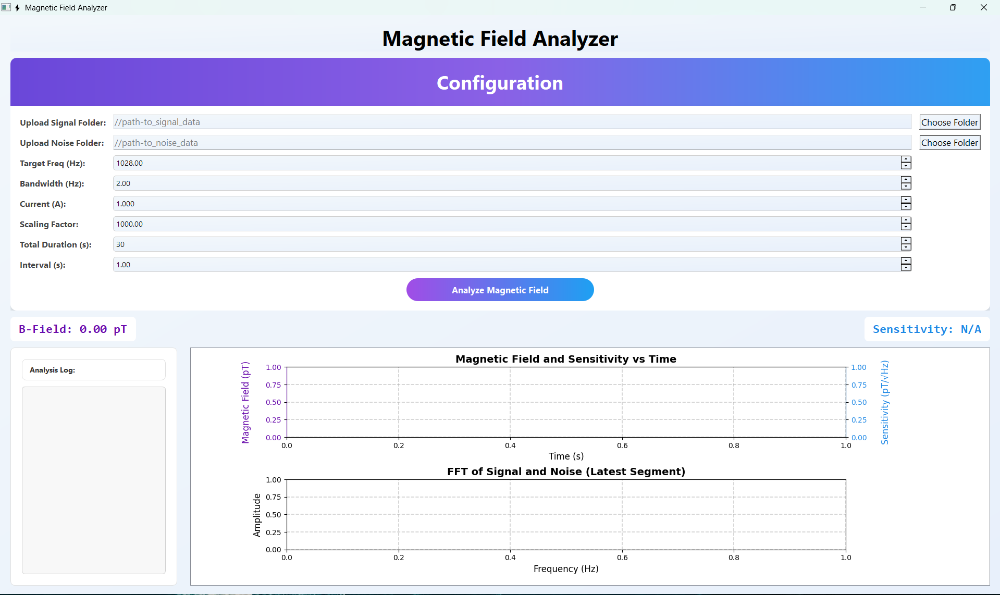

Magnetic Field Analyzer ⚡
A Python-based GUI application for magnetic field signal analysis using FFT-based spectral processing.
The tool processes signal and noise waveform CSV data, computes magnetic field intensity, signal-to-noise ratio (SNR), and sensitivity, and visualizes results in real time.

Built with PyQt5, NumPy, and Matplotlib, the application provides an interactive interface for researchers and engineers working with electromagnetic signal measurements.

Overview

This tool performs frequency-domain analysis on recorded waveform data to estimate magnetic field strength and system sensitivity.

The analyzer:

Loads signal and noise CSV datasets

Performs FFT-based spectral analysis

Extracts the target frequency component

Estimates noise floor

Computes SNR

Calculates magnetic field amplitude and sensitivity

Displays live plots and logs

Saves per-interval results as CSV files

Features
Data Processing

Load multiple CSV waveform files

Automatic data concatenation

Signal detrending and normalization

FFT-based frequency analysis

Magnetic Field Estimation

Target frequency detection

Noise RMS estimation

Signal-to-noise ratio calculation

Magnetic field intensity calculation

Sensitivity estimation (pT/√Hz)

Visualization

Real-time plots

Magnetic Field vs Time

Sensitivity vs Time

FFT Spectrum of Signal & Noise

Dynamic GUI updates

Data Export

Automatic per-second result export

CSV output includes:

Time

Magnetic field strength

SNR

Sensitivity

User Interface

Clean PyQt5 interface

Configurable parameters

Interactive folder selection

Analysis logs and status display

Application Interface

The GUI provides:

Configuration Panel

Signal folder input

Noise folder input

Target frequency

Bandwidth

Current

Scaling factor

Total duration

Analysis interval

Analysis Output

Magnetic field value

Sensitivity value

Real-time analysis log

Plots

Time-domain results

FFT spectrum visualization

Project Structure
MAGNITOOL/
│
├── csv_ganretor_script/
│   ├── dynamic_s&n_creator.py
│   └── s&n_creator.py
│
├── output_segments_1sec/
│
├── Resource/
│   ├── global_noise/
│   └── global_signal/
│
├── main.py
└── requirement.txt

The application is designed for research workflows involving electromagnetic measurements and noise analysis.
